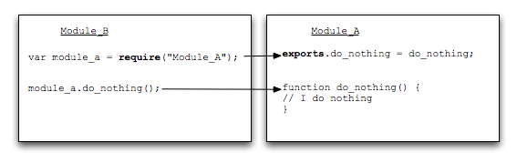

[原文链接](http://gywbd.github.io/posts/2014/11/using-exports-nodejs-interface-design-pattern.html)

### 0x01 require()源码解读

学习 Node.js ，必学如何使用 require 语句。本文通过源码分析，详细介绍 require 语句的内部运行机制，帮你理解 Node.js 的模块机制。



#### 1.1 使用方法

当 Node 遇到 require(X) 时，按下面的顺序处理：

（1）如果 X 是内置模块（比如 require('http'）) 

- 返回该模块 
- 不再继续执行

（2）如果 X 以 "./" 或者 "/" 或者 "../" 开头 

- 根据 X 所在的父模块，确定 X 的绝对路径。 
- 将 X 当成文件，依次查找下面文件，只要其中有一个存在，就返回该文件，不再继续执行。

```
X
X.js
X.json
X.node
```

- 将 X 当成目录，依次查找下面文件，只要其中有一个存在，就返回该文件，不再继续执行。

```
X/package.json（main字段）
X/index.js
X/index.json
X/index.node
```

（3）如果 X 不带路径 

- 根据 X 所在的父模块，确定 X 可能的安装目录。 
- 依次在每个目录中，将 X 当成文件名或目录名加载。

（4） 抛出 "not found"

### 0x02 exports和module.exports

声明如下：

```
//写法1
exports.hello = function(){
    console.log(‘world’);
}

//写法2
var f = {
    hello : function(){
        console.log(‘world’);
    }
}

module.exports = f;
```

使用如下：

```
var h = require(‘hello’);
h.hello();
```

根据使用场景，提炼了7种模式：

- exports命名空间
- exports一个工厂方法
- exports一个偏函数
- exports构造函数
- exports单例
- 扩展全局对象
- 实现Monkey Patch

#### 2.1 exports命名空间

```
// 声明一个命名空间
exports.User = require('./user');
exports.Person = require('./person');

// 使用一个命名空间
var namespace = require('./namespace');
var User = namespace.User;
var Person = namespace.Person;
```

#### 2.2 exports工厂方法

```
module.exports = function () {
	// return an instance;
};
```

#### 