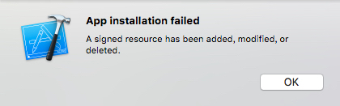

## iOS 8真机无法调整的问题

### 1. App installation failed 
iOS 8 调试一次后出现问题

##### 解决方案
`rm -rf ~/Library/Developer/Xcode/DerivedData/<your_app>-*/Build/Products/Debug-iphoneos/ShareExtension.appex/`  

对于邮箱大师，直接使用：  
`rm -rf ~/Library/Developer/Xcode/DerivedData/mail-*/Build/Products/Debug-iphoneos/MailMasterShareExtension.appex/`

参考链接  [http://stackoverflow.com/questions/25639270/xcode-6-beta-7a-signed-resource-has-been-added-modified-or-deleted](http://stackoverflow.com/questions/25639270/xcode-6-beta-7a-signed-resource-has-been-added-modified-or-deleted)