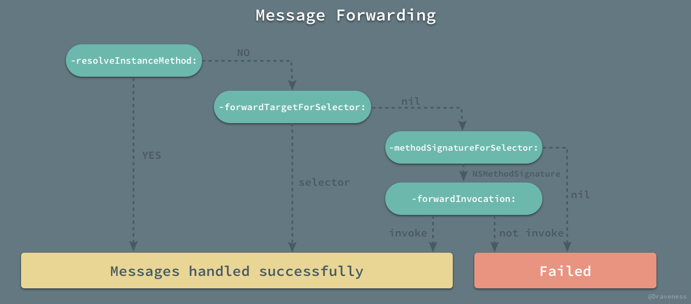

# 基于AOP+NSProxy的网络流量统计及性能监控组件的实现

**标签：**`Runtime`，`AOP`，`消息转发`，`网络流量监控`

首先我们先介绍一下基本术语，什么是AOP及NSProxy的用途，最后再简单介绍一下如何通过这两个东西实现网络流量及性能监控的实现；

### 0x01 AOP介绍

AOP（切面编程，Aspect Oriented Programming的缩写），实现DI（信赖注入）的框架或者是工具，此处不做过多的展开介绍，可参考以下不同语言的实现：

- [[Google|Guice]](https://github.com/google/guice)
- [[Facebook|Fishhook]](https://github.com/facebook/fishhook)
- [[Aspects]](https://github.com/steipete/Aspects)，基于Objective-C的实现，有兴趣的同学可以研究一下其它实现方法；
- 其它

### 0x02 NSProxy介绍

与`NSObject`类（class）一样，另外一个实现`<NSObject>`协议的基类，与`NSObject`基类不同之处，`NSProxy`是一个抽象基类，没有默认的`initializer`方法，需要子类去实现；并且在子类中必须实现以下两个方法：

- \- (void)forwardInvocation:(NSInvocation *)invocation;
- \- (nullable NSMethodSignature *)methodSignatureForSelector:(SEL)sel;

> NOTE: forwardInvocation:方法是发挥想像力的地方，不但可以执行Native实例的方法，还可以执行RPC调用等高级玩法；

在这里，我也不免俗，上一些代码看一下与NSObject基类在调用NSObject协议方法时有哪些不同，上面已经提到了`NSProxy`是一个抽象基类，此处不再赘述；主要看以下几个协议方法：

```
- (BOOL)isProxy;

- (BOOL)isKindOfClass:(Class)aClass;
- (BOOL)isMemberOfClass:(Class)aClass;
- (BOOL)conformsToProtocol:(Protocol *)aProtocol;

- (BOOL)respondsToSelector:(SEL)aSelector;
```

测试代码：

```
// NEProxy.m
@interface NEProxy ()

@property (nonatomic, weak) id target;
@property (nonatomic, weak) id delegate;

@end

@implementation NEProxy

+ (instancetype)proxyWithTarget:(id)target delegate:(id)delegate
{
    NEProxy *proxy = [NEProxy alloc];
    
    proxy.target = target;
    proxy.delegate = delegate;
    
    return proxy;
}

- (void)forwardInvocation:(NSInvocation *)invocation
{
    if ([self.target respondsToSelector:invocation.selector]) {
        [invocation invokeWithTarget:self.target];
    }
    
    if ([self.delegate respondsToSelector:invocation.selector]) {
        [invocation invokeWithTarget:self.delegate];
    }
}

- (NSMethodSignature *)methodSignatureForSelector:(SEL)sel
{
    NSMethodSignature *signature = [self.target methodSignatureForSelector:sel];
    
    // similar to the method: void * isEnabled(void) {}
//    signature = [NSMethodSignature signatureWithObjCTypes:"@@:"];
    
    return signature;
}

@end

// main.m

int main() {
		NSString *greeting = @"hello, world."; // length = 13
		NEProxy *proxy = [NEProxy proxyWithTarget:greeting delegate:nil];
		
		assert([proxy isKindOfClass:[NSString class]]);
//	  	assert([proxy isMemberOfClass:[NSString class]]);
		assert([proxy conformsToProtocol:@protocol(NSCopying)]);
		assert([proxy respondsToSelector:@selector(length)]);
		
		NSNumber *length = @([(NSString *)proxy length]);
		length = [(NSObject *)proxy valueForKey:@"length"];
		
		if ([proxy isEqual:greeting]) {
				// not reached
		}
		
		return 0;
}
```

做一个简单的分析，以上代码编译+运行没有问题，也是按预期执行的；

#### 2.1 isProxy方法

刚开始接触Objective-C学习的时候，发现`NSObject`协议下的`- (BOOL)isProxy`getter方法的作用是什么，即使是看了说明文档在常规开发中几乎很少用的到；

先看一下文档说明：

*Returns a Boolean value that indicates whether the receiver does not descend from NSObject.*

*This method is necessary because sending isKindOfClass: or isMemberOfClass: to an NSProxy object will test the object the proxy stands in for, not the proxy itself. Use this method to test if the receiver is a proxy (or a member of some other root class).*

简单翻译一下，大概意思是“返回一个布尔值用于标识消息接收对象是否派生自`NSObject`基类的实例；这个方法很有必要，尤其是消息接收对象是一个`NSProxy`对象时，因为诸如`isKindOfClass:`等消息是发送给`NSProxy`代理的对象（以上原代码中，NEProxy代理的对象是target）而不是`NSProxy`的实例；`YES`表示消息接收对象是一个`NSProxy`实例；否则`NO`表示消息接收对象是一个`NSObject`实例；

#### 2.2 消息转发的过程

上述原代码中，以`[(NSString *)proxy length]`为例，直接给proxy对象发送length消息会出现编译错误，原因很简单，proxy这个类没有length成员方法，所以这里加了一个强制类型转换用于骗过编译器，便于在运行时时可以成功转发length消息到proxy对象；大体流程如下图所示：



后面再详细介绍`forwardInvocation：`和`methodSignatureForSelector：`的注意事项；

#### 2.3 对比结论

在NSProxy中，以下方法：

```
- (BOOL)isKindOfClass:(Class)aClass;
- (BOOL)isMemberOfClass:(Class)aClass;
- (BOOL)conformsToProtocol:(Protocol *)aProtocol;
- (BOOL)respondsToSelector:(SEL)aSelector;

```

会被转发到代理对象中，其它方法的调用与NSObject表现均一致，若有新的发现，请多多指教；

若执行以下代码会出现什么情况：

```
__unused NSNumber *length2 = [proxy performSelector:@selector(length)];
```
> NOTE: 以上代码的消息不会被转发，请读者自行尝试，看看会抛出什么样子的异常

### 0x03 网络流量及性能监控

#### 3.1 实现思想

以`NSURLConnection`为例，监听`connection`实例的`delegate`的回调方法，完成网络流量及性能监控，并且不侵入现有业务代码；

#### 3.2 代码实现

##### 3.2.1 如何hook库API

直接上代码，然后再慢慢分析：

```
// NENetworkingMonitor.m

...

- (void)startInterceptURLConnection
{
self.urlConnectionInterceptTokens = [NSMutableArray array];
    
    id token_init =
    [NSURLConnection aspect_hookSelector:@selector(initWithRequest:delegate:)
                             withOptions:AspectPositionBefore
                              usingBlock:
     ^ (id<AspectInfo> instance, NSMutableURLRequest *request, id delegate) {
         if (![request isKindOfClass:[NSMutableURLRequest class]]) {
         		 // 可添加自定义header等操作
             request = request.mutableCopy;
         }
         
         // NSProxy没有默认初始化方法，子类去实现
         NEURLConnectionProxy *proxy = [NEURLConnectionProxy alloc];
         [proxy proxyUsingDelegate:delegate];
         
         [instance.originalInvocation setArgument:&proxy atIndex:3];
         // 通过arguments 持有proxy
         if (instance.arguments) {
             NSLog(@"");
         }
     } error:NULL];
    [self.urlConnectionInterceptTokens addObject:token_init];
    
    ...
    
    // hook其它接口
}

- (void)stopInterceptURLConnection
{
    ...
}
```

利用AOP工具hook`NSURLConnection`的`initWithRequest:delegate:`方法，再次编辑`request`对象，替换`delegate`为`proxy`对象，替换`invocation`的参数等等操作，通过`proxy`再转发消息到`delegate`，达到不侵入现有代码的目的，原理很简单；

> NOTE：`[instance.originalInvocation setArgument:&proxy atIndex:3]`为什么参数的位置是第四个参数，与其它面向对象语言的实现不同，`Objective-C`的`this`指针（receiver对象）在消息传递过程中被放置在参数列表的第一个位置，第二位置放置`__cmd`（消息名称，或Selector），后面依次类推是方法中出现的参数列表，整合以后，在`invocation`的参数列表中的参数为[self, selector, param1, param2, ...]；所以，`delegate`被替换为`proxy`时，替换的是第四个参数；

##### 3.2.2 实现proxy

代码如下：

```
// NEURLConnectionProxy.m

@interface NEURLConnectionClient : NSObject <NSURLConnectionDataDelegate>

@property (nonatomic, strong) NSURLRequest *request;

@property (nonatomic, assign) NSTimeInterval duration;
@property (nonatomic, assign) NSUInteger sendDataLength;
@property (nonatomic, assign) NSUInteger receiveDataLength;
@property (nonatomic, strong) NSError *error;

/// default unit is Kb
+ (NSString *)networkTrafficAmount;

@end

@implementaion NEURLConnectionClient

// 实现NSURLConnectionDataDelegate协议方法，进行流量统计，此处不再粘贴代码，读者自行设计

@end		// NEURLConnectionClient

@interface NEURLConnectionProxy ()

@property (nonatomic, weak) id delegate;

@property (nonatomic, strong) NEURLConnectionClient *client;

@end

@implementation NEURLConnectionProxy

- (void)proxyUsingDelegate:(id)delegate
{
    self.delegate = delegate;
    
    self.client = [NEURLConnectionClient new];
}

- (BOOL)respondsToSelector:(SEL)aSelector
{
    return [self.delegate respondsToSelector:aSelector] || [self.client respondsToSelector:aSelector];
}

- (void)forwardInvocation:(NSInvocation *)invocation
{
    if ([self.client respondsToSelector:invocation.selector]) {
        [invocation invokeWithTarget:self.client];
    }
    
    if ([self.delegate respondsToSelector:invocation.selector]) {
        [invocation invokeWithTarget:self.delegate];
    }
}

- (NSMethodSignature *)methodSignatureForSelector:(SEL)sel
{
    if ([self.delegate respondsToSelector:sel]) {
        return [self.delegate methodSignatureForSelector:sel];
    }
    
    // WARN:(hzyuxiaohua)此处代码的意义就是返回一个非空的signature，保证不崩溃，没有其它意义
    // 具体涵义请翻阅https://developer.apple.com/library/content/documentation/Cocoa/Conceptual/ObjCRuntimeGuide/Articles/ocrtTypeEncodings.html#//apple_ref/doc/uid/TP40008048-CH100-SW1
    return [NSMethodSignature signatureWithObjCTypes:"@^v^c"];
}

@end    // NEURLConnectionProxy
```

总感觉代码一贴，就没有必要再多说了；

我们通过`NEURLConnectionClient`实例可以得到`connection`的回调数据，在其`delegate`方法内实现流量统计，错误监听，会话时长等等一系列性能指标，数据收集后回传统计服务器生成数据报表即可，没有太大的复杂度；

下面我们着重介绍一下`NEURLConnectionProxy`的实现，主要注意以下两点：

1. **forwardInvocation:**方法，保证原`delegate`的方法可以被正常调用，此处代理的对象简单，没有处理有返回值的方法，若被调用的方法有返回值怎么办？！
2. **methodSignatureForSelector:**方法，保证返回正确的`signature`，对`delegate`不能处理的方法要做到合理的控制，否则运行时会执行出异常；

最后，看一下代码运行结果：

```
# Monitor Message: {
	Instance: 0x600000c5e180
	Url:http://220.181.14.110/apptrack/confinfo/searchMultiAds.do
	Send Data: 280 bytes
	Receive Data: 1840 bytes
	Error:(null)
	Duration: 219.713 MS
	All Traffic Amount: 65.50 KB(s). }
	...
	All Traffic Amount: 1.60 MB(s). }
	All Traffic Amount: 1.77 MB(s). }
	All Traffic Amount: 1.77 MB(s). }
	All Traffic Amount: 1.96 MB(s). }
	All Traffic Amount: 1.96 MB(s). }
	All Traffic Amount: 2.15 MB(s). }
	All Traffic Amount: 2.15 MB(s). }
	All Traffic Amount: 2.26 MB(s). }
	All Traffic Amount: 2.26 MB(s). }
```

### 0x04 小结

`NSProxy`抽象基类常规开发中很少用到，但是它比`NSObject`的派生类更适合运行时的`消息转发`，`forwardInvocation:`发挥想象力的空间非常大；

利用AOP实现的不侵入现有业务代码，实现对库API下钩子的目的，实现简单，目前在无埋点，可视化埋点统计方面也发挥了很大的作用；

最后，祝读者生活愉快；