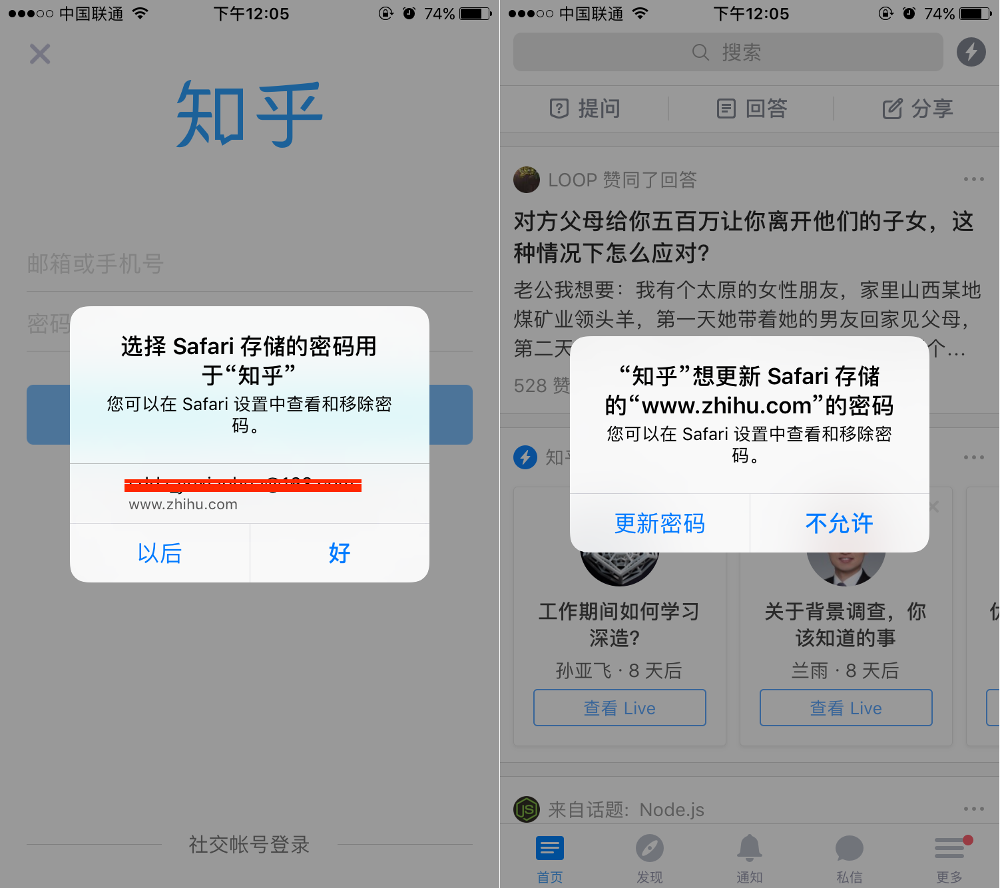

第一次见到应用程序访问Safari内保存的用户名和密码是「知乎」上，如下图所示



看到这图时，感觉这东西非常方便Native应用程序登录，删除再次安装时可以自动提示用户选择一个账号登录而无须敲键盘，即使密码有更新，提示登录失败后再重新输入新密码还可以更新；

这个功能其实早在iOS8.0就引入了，其目的就是减化用户登录时的操作复杂度，算是一个隐藏的Safari的新特性；

## 0x01 SecurityFramework

### 1.1 SecSharedCredential Header

SecSharedCredential defines CoreFoundation-based functions for storing and requesting shared password-based credentials. These credentials are currently able to be shared with Safari and applications which have a 'com.apple.developer.associated-domains' entitlement that includes the domain being requested.

`SecSharedCredential`定义了基于`CoreFoundation`的用于存储和请求共享密码凭证一系列方法。目前，这些凭证可以用于应用程序和Safari共享，前提是这些应用程序必须申请`com.apple.developer.associated-domains`权限，配置详见AppleDoc；

### 1.2 SecAddSharedWebCredential

```
/*!
 @function SecAddSharedWebCredential
 @abstract Asynchronously store (or update) a shared password for a website.
 @param fqdn The fully qualified domain name of the website requiring the password.
 @param account The account name associated with this password.
 @param password The password to be stored. Pass NULL to remove a shared password if it exists.
 @param completionHandler A block which will be invoked when the function has completed.
 If the shared password was successfully added (or removed), the CFErrorRef parameter passed 
 to the block will be NULL. If the error parameter is non-NULL, an error occurred and the error 
 reference will hold the result. Note: the error reference will be automatically released after 
 this handler is called, though you may optionally retain it for as long as needed.
 @discussion This function adds a shared password item which will be accessible by Safari and 
 applications that have the specified fully-qualified domain name in their 
 'com.apple.developer.associated-domains' entitlement. If a shared password item already exists 
 for the specified website and account, it will be updated with the provided password. To remove 
 a password, pass NULL for the password parameter.

 Note: since a request involving shared web credentials may potentially require user interaction 
 or other verification to be approved, this function is dispatched asynchronously; your code 
 provides a completion handler that will be called once the results (if any) are available.
 */
void SecAddSharedWebCredential(CFStringRef fqdn, CFStringRef account, CFStringRef __nullable password,
    void (^completionHandler)(CFErrorRef __nullable error))
```

该方法用于添加(或更新)用户名和密码到Safari用户名和密码管理器；

### 1.3 SecRequestSharedWebCredential

```
/*!
 @function SecRequestSharedWebCredential
 @abstract Asynchronously obtain one or more shared passwords for a website.
 @param fqdn (Optional) Fully qualified domain name of the website for which passwords are being 
 requested. If NULL is passed in this argument, the domain name(s) listed in the calling application's
 'com.apple.developer.associated-domains' entitlement are searched implicitly.
 @param account (Optional) Account name for which passwords are being requested. The account may be 
 NULL to request all shared credentials which are available for the site, allowing the caller to discover 
 an existing account.
 @param completionHandler A block which will be called to deliver the requested credentials. If no matching 
 items were found, the credentials array will be empty, and the CFErrorRef parameter will provide the 
 error result. Note: the credentials and error references will be automatically released after this handler 
 is called, though you may optionally retain either for as long as needed.
 @discussion This function requests one or more shared passwords for a given website, depending on whether 
 the optional account parameter is supplied. To obtain results, the website specified in the fqdn parameter 
 must be one which matches an entry in the calling application's 'com.apple.developer.associated-domains' entitlement.

 If matching shared password items are found, the credentials provided to the completionHandler will be 
 a CFArrayRef containing CFDictionaryRef entries. Each dictionary entry will contain the following pairs 
 (see Security/SecItem.h):
        key: kSecAttrServer     value: CFStringRef (the website)
        key: kSecAttrAccount    value: CFStringRef (the account)
        key: kSecSharedPassword value: CFStringRef (the password)

 If the found item specifies a non-standard port number (i.e. other than 443 for https), the following 
 key may also be present:
        key: kSecAttrPort       value: CFNumberRef (the port number)

 Note: since a request involving shared web credentials may potentially require user interaction or other 
 verification to be approved, this function is dispatched asynchronously; your code provides a completion 
 handler that will be called once the results (if any) are available.
 */
void SecRequestSharedWebCredential(CFStringRef __nullable fqdn, CFStringRef __nullable account,
    void (^completionHandler)(CFArrayRef __nullable credentials, CFErrorRef __nullable error))
    __OSX_AVAILABLE_STARTING(__MAC_NA, __IPHONE_8_0) __WATCHOS_UNAVAILABLE __TVOS_UNAVAILABLE;
```

该方法用于从Safari用户名和密码管理器请求用户名和密码；

### 1.4 SecCreateSharedWebCredentialPassword

```
/*!
 @function SecCreateSharedWebCredentialPassword
 @abstract Returns a randomly generated password.
 @return CFStringRef password in the form xxx-xxx-xxx-xxx where x is taken from the sets 
 "abcdefghkmnopqrstuvwxy", "ABCDEFGHJKLMNPQRSTUVWXYZ", "3456789" with at least one character 
 from each set being present.
*/
__nullable
CFStringRef SecCreateSharedWebCredentialPassword(void)
    __OSX_AVAILABLE_STARTING(__MAC_NA, __IPHONE_8_0) __WATCHOS_UNAVAILABLE __TVOS_UNAVAILABLE;
```

这个方法就是一个密码Generator，用于生成高度安全复杂的随机密码，不用自己再使用伪随机算法生成了，直接调用该方法即可；