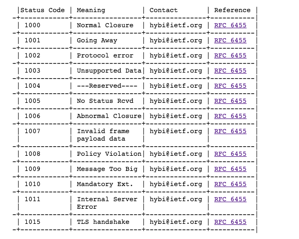

## WebSocket Protocol

### 0x01 基于Http的协议

#### 1.1 握手

handshake阶段使用带有**Upgrade**Header的Http请求，请求方法为Get，其实websocket就是使用http进行握手，握手的过程升级http协议为websocket，具体头内容如下：

```
http 1.1
host: host:port
upgrade: websocket
connection: websocket
sec-websocket-protocol: chat
sec-websocket-key: base64 string
```

其中，websocket的配置选项也在http的请求头内，具体查看协议标准文档；

#### 1.2 sec-key的使用

服务端收到`sec-websocket-key`后，在其后拼接一个**固定的**`GUID`，其值为**258EAFA5-E914-47DA-95CA-C5AB0DC85B11**，采用**sha-1**获取其摘要并生成**base64**的字符串，然后将得到的字符串设置在http的响应头`sec-websocket-accept`；

```
digest = base64(sha1(req-string+guid));
```

#### 1.3 与TCP和Http的关系

它是一个独立的基于TCP的协议，只是利用带有Http的Upgrade头的请求建立链接，最低支持Http1.1版本；

#### 1.4 URI

```
scheme://host[:port]/resource-name/secure-flag

其中，scheme可以是ws, wss, http和https，除此之外的scheme请求均不会由websocket处理；

```

### 2 Frame

```
    0                   1                   2                   3
      0 1 2 3 4 5 6 7 8 9 0 1 2 3 4 5 6 7 8 9 0 1 2 3 4 5 6 7 8 9 0 1
     +-+-+-+-+-------+-+-------------+-------------------------------+
     |F|R|R|R| opcode|M| Payload len |    Extended payload length    |
     |I|S|S|S|  (4)  |A|     (7)     |             (16/64)           |
     |N|V|V|V|       |S|             |   (if payload len==126/127)   |
     | |1|2|3|       |K|             |                               |
     +-+-+-+-+-------+-+-------------+ - - - - - - - - - - - - - - - +
     |     Extended payload length continued, if payload len == 127  |
     + - - - - - - - - - - - - - - - +-------------------------------+
     |                               |Masking-key, if MASK set to 1  |
     +-------------------------------+-------------------------------+
     | Masking-key (continued)       |          Payload Data         |
     +-------------------------------- - - - - - - - - - - - - - - - +
     :                     Payload Data continued ...                :
     + - - - - - - - - - - - - - - - - - - - - - - - - - - - - - - - +
     |                     Payload Data continued ...                |
     +---------------------------------------------------------------+
```

到目前为止，websocket的opcode包括控制帧和非控制帧，其中，控制帧分别：

- 关闭帧，收到该数据帧后进行协商关闭websocket连接；
- Ping帧，一般由服务端发向客户端，用于验证客户端是否在线；
- Pong帧，一般由客户端收到服务端的Ping帧后发向服务商的响应帧，告知服务端该客户端正常在线；

> **NOTE：**Ping帧和Pong帧的发送方向待验证；

#### 2.1 websocket常用错误码



[RFC6455链接](https://tools.ietf.org/html/rfc6455)