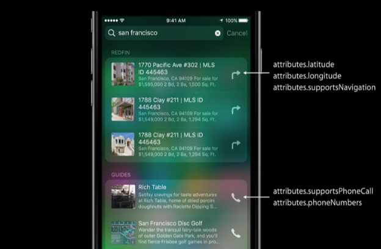

## title

### 0x0. What's New in iOS 10

- Search in App
- CoreSpotlight Search API
- Differential Privacy
- Visual Preview in Web Markup Tool

### 0x1. Adopting Search APIs

- Indexing content
- Rich presentation
- Launching into your app
- CoreSpotlight Search API
- Optimizing for ranking


#### 1.1 CoreSpotlight Refresher

```
// adding items to the index

let attrs : CSSearchableItemAttributeSet = CSSearchableItemAttributeSet(itemContentType:kUTTypeItem as String)
attrs.displayName = "Hello world!"
let item = CSSearchableItem(uniqueIdentifier:"hello", domainIdentifier:"Greetings", attributeSet:attrs)
CSSearchableIndex.defaultIndex().indexSearchableItems([item]), completionHandler:handler)
```

```
// deleting items from the index, 3 APIs

CSSearchableIndex.defaultIndex().deleteSearchableItems(withIdentifiers:["hello"], completeHandler:handler)

CSSearchableIndex.defaultIndex().deleteSearchableItems(withDomainIdentifiers:["Greetings"], completeHandler:handler)

CSSearchableIndex.defaultIndex().deleteAllSearchableItems(completeHandler:handler)
```

#### 1.2 Indexing with CoreSpotlight

Best practices

- Registering as an index delegate
- Use client state API for asynchronous indexing
- Performance considerations
- Creating a CoreSpotlight extension

##### 1.2.1 Registering as an index delegate

to be ignored, see wwdc 2015 associated sessions about `CoreSpotlightSearch` API.

##### 1.2.2 Performance considerations

- Minimize overhead, optimize storage and database access
- Use batching, size batches for memory overhead
- Don't block the mainthread
- Index on a background thread

#### 1.3 CoreSpotlight Extension

Catching up in the background

- The extension can index when your app isn't running
- Recover after restore from backup

```
func searchableIndex(_:CSSearchableIndex, reindexAllSearchableItemsWithAcknowledgmentHandler acknowledgementHandler:()->void {
	// reindex everything, then call handler
	acknowledgementHandler()
}

func searchableIndex(_:CSSearchableIndex, reindexSearchableItemsWithIdentifiers identifiers:[String], acknowledgementHandler:()->void {
	// reindex items for the identifiers, then call handler
	acknowledgementHandler()
}
```

#### 1.4 Indexing with NSUserActivity

> Not Concern, may be added on future

### 0x2 Creating a Great Visual Experience

- Provide descriptive title, description, and compelling thumbnail
- Set the right contentType for your content
- Use attributes to fill out the UI




### 0x3 Continue Search in App

#### 3.1 Enabling Search Continuation

- Declare that your app supports `Search Continuation`
- Add a **CoreSpotlightContinuation** key in your info.plist
- Implement user activity support

```
func application(application:UIApplication, continueUserActivity userActivity:NSUserActivity, restorationHandler:([AnyObject]?)->void)->bool {
	if userActivity.activityType == CSQueryContinuationActionType {
		if let searchQuery = userActivity.userInfo?[CSSearchQueryString] as? String {
			// Invoke your search API
		}
		
		return true
	}
	
	return false
}
```

