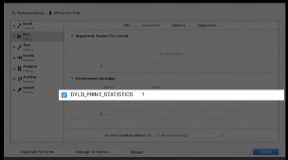

## Optimizing App Startup Time

### Improving Launch Times

#### launch recap

- parse images
- map images
- rebase images
- bind images
- run image initializer
- call main()
- call UIApplicationMain()
- call applicationWillLaunching

#### warm launch vs cold launch

##### warm launch

- App and data already in memory

##### cold launch

- App not in kernel buffer cache

> NOTE:cold launch testing after iOS reboot()

#### measurement

Dylib has built-in measurements, `DYLD_PRINT_STATISTICS` environment variable

- Available on shipping OSes
- Significantly enhanced in ew OSes
- Available on seed 2

Debugger pauses every dylib load

- Dyld substracts out debugger time

Dylib Loading

1. Embedded dylibs are expensive
2. Use fewer dylibs

	- Merge existing dylibs
	- Use Static archeives

3. Lazy load, but ...

	- `dlopen()` can cause issues
	- Actually more work overall

Rebasing/binding

1. Reduce __DATA pointers
2. Reduce Obj-C metadata

	- Classes, selectors and categories

3. Reduce C++ virtual
4. Use `Swift` structs(generate better codes)
5. Examine machine generated code

	- Use offsets instead of pointers
	- Mark read only

ObjC setup

1. Class registration
2. Non-fragile ivars offsets updated
3. Category registration
4. Selector uniquing

Initializers

Explicit:

1. ObjC `+load()` methods
	
	- replace with `+initialize()`

2. C/C++ __attribute__((constructor))
3. Replace with call site initializers

	- dispatch_once()
	- pthread_once()
	- std::once()

Implicit:

1. C++ statics with non-trivial constructors

	- Replace with call site initializers
	- Only set simple values(PODs)
	- -Wglobal-constructors
	Rewrite in `Swift`

2. Do not call `dlopen()` in initializers
3. Do not create threads in initializers
