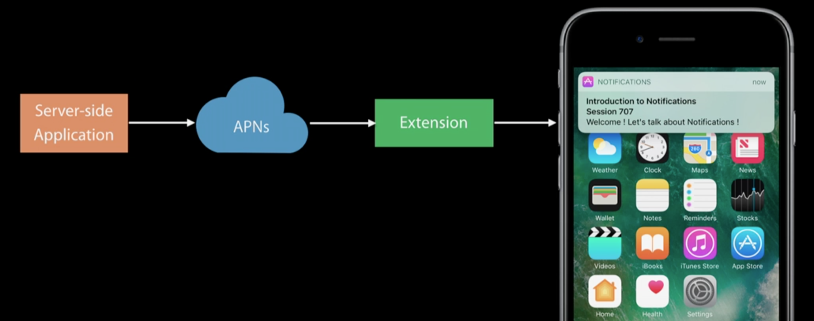

### 0x01 User Notifications

与`UIKit`库中的`UIUserNotification`相似，iOS X引入了全新的UserNotification库——「UserNotifications.framework」和「UserNotificationsUI.framework」，提供了更加丰富的通知系统，如`ServiceExtension`和`ContentExtension`等。

#### 1.1 iOS

Full support to schedule and manage notifications

#### 1.2 watchOS

Existing support for forwarded notifications

Local Notifications on the watch**`NEW`**

#### 1.2 tvOS

Suport to badge app icons

Example:

- 3 unwatched episodes
- Pending user turn in game

### 0x02 Notification Delivery

#### 2.1 Registration

##### 2.1.1 User Authorization

向设备注册通知类型，类型如下：

- Banners
- Sound alerts
- Badging

与iOX8.0提供的接口类似，接口更加简洁短小，语义更加明确；

```
// listing 1
// Set notification configration
UNUserNotificationCenter.current().requestAuthorization([.sound, .alert, .badge]) { (success, error) in ... }

// 若想获取「remotepush」的token，添加如下代码
// @available(iOS 8.0, *)
UIApplication.shared().registerForRemoteNotifications()
```

> **NOTE:**若不准备采用UserNotifications.framework提供的新特性，通知模块的代码不需要为iOS X做额外的适配即可正常工作。

##### 2.1.2 Notification settings

```
// listing 2
// Access to user-defined settings(Configurable in Settings per app)

UNUserNotificationCenter.current().getNotificationSettings { (settings) in ... }
```

##### 2.1.3 Token Registration(Remote Notifications)


figure 1, remote notification token registeration


```
// listing 3
// Existing API

UIApplication.shard().registerForRemoteNotifications()
```

##### 2.1.4 Notifications Delivery

Local Notification

```
// listing 4

let content = UNMutableNotificationContent()
content.title = "Introduction to Notifications"
content.subtitle = "Session 707"
content.body = "Woah! These new notifications look amazing! Don't you agree?"
content.badge = 1
```

> **NOTE：**ServiceExtension作为通知加解密和添加通知附件等特性被引入是用于解决「RemoteNotification」存在的短板问题，与「LocalNotification」不同，本地通知由iOS系统直接调度无需网络的参与，附件可直接指定，更不需要对通知内容做解密；所以，本地通知的present不会唤起ServiceExtension再正常不过了。

Remote Notification

```
// listing 5

{
	"aps" : {
		"alert" : {
			"title":"Introduction to Notifications",
			"subtitle":"Session 707",
			"body":"Woah! These new notifications look amazing! Don't you agree?"
		},
		"badge":1
	},
}
```

#### 2.2 Push Triggers

1. Push
2. TimeInterval
3. Calendar
4. Location

### 3 Notification Handling

#### 3.1 Application in foreground

```
// listing 6
protocol UNUserNotificationCenterDelegate : NSObjectProtocol

func userNotificationCenter(_ center : UNUserNotificationCenter, willPresent notification : UNNotification, withCompleteHandler completeHandler : (UNNotificationPresentOptions)->Void)
```

```
// in-app presentation

func userNotificationCenter(_ center : UNUserNotificationCenter, willPresent notification : UNNotification, withCompleteHandler completeHandler : (UNNotificationPresentOptions)->Void) {
	// roll banner, and sound alert
	completeHandler([.sound, .alert])
}
```

> **NOTE：**以上两个Delegate方法替换了`application:didReceiveLocalNotification：`、
> `application:didReceiveRemoteNotification：`、
> `application:handleActionWithIdentifier：forLocalNotification：completionHandler：`、
> `application:handleActionWithIdentifier：forLocalNotification：completionHandler：`
> 四个方法，通知的处理简化为两个方法不再区分本地和远程，使接口语义更加清晰。

### 4 Notification Management

**Overview**

- Access:

	- Pending Notificatoins
	- Delivered Notifications

- Remove Notifications
- Update and Promote Notifications

> **NOTE：**该部分的功能基本与「UIKit」提供的功能一致，只是在「ServiceExtension」中添加了对「RemoteNotification」的编辑支持，下面会有详细的介绍；

#### 4.1 Request Identifier

Local Notifications

- set on notification request

Remote Notifications

- New field on the `Http/2` request header: `apns-collapse-id`

```
// listing 7
// pending notfication removal

let identifier = "game.start.identifier"
let req = UNUserNotificationRequest(identifier:identifier, content:content, trigger:trigger)
UNUserNotificationCenter.current().add(req) { (error) in // ... }

// game start time was updated
let updated_req = UNUserNotificationRequest(identifier:identifier, content:content, trigger:new_trigger)
UNUserNotificationCenter.current().add(updated_req) { (error) in // ... }

// game was cancelled
UNUserNotificationCenter.current().removePendingNotificationRequests(withIdentifiers:[identifier])
```

### 5 Notification Actions

#### 5.1 Actionable Notifications

- Buttons with Customizable title
- Text input(quick reply)
- Background and Foreground actions
- iOS and watchOS

#### 5.2 Registeration

```
// listing 8
// default belongs to background action

let action = UNNotificationAction(identifier:"reply", title:"reply", options:[])

let category = UNNotificationCategory(identifier:"message", actions:[action], minimalActions:[action], intentIdentifiers:[], options:[])

UNUserNotificationCenter.current().setNotificationCategories([category])

```

> **NOTE：**iOS X引入了action的**options**，用于标识该action的运行权限，主要有auth（需要解锁设备后运行）、destrutive（标识该action具有破坏性）和foreground（唤醒App并在前台运行），可组合使用，如：[.auth, .destructive, .foreground]

#### 5.3 Presentation

```
// listing 9
// remote notifications

{
	"aps" : {
		alert:"Welcome to WWDC!",
		category:"message"
	}
	
}

// local notifications

content.categoryIdentifier = "message"

```

#### 5.4 Dismiss Action

##### 5.4.1 Category option

```
// listing 10

customDismissAction: UNNotificationCategoryOptions

let category = UNNotificationCategory(identifier:"message", actions:[action], minimalActions:[action], intentIdentifiers:[], options:[.customDismissAction])
```

#### 6 Response Handling

```
// listing 11

protocol UNUserNotificatoinCenterDelegate: NSObjectprotocol

func userNotificationCenter(_ center:UNUserNotificationCenter, didReceive response: UNNotificatonResponse, withCompleteHandler handler:()->Void)

```


figure 2, reponse handling	

### 7 Service Extension

Basics

- Non UI iOS Extension
- Augment or Replace the content of visible Remote Notifications

> short time excution

Potential uses

- end-to-end encryption
- add attachment



figure 3, notificaton service extension

> How to implement was ignored here.

```
// listing 12
import UserNotifications

class NotificationService: UNNotificationServiceExtension {

    var contentHandler: ((UNNotificationContent) -> Void)?
    var bestAttemptContent: UNMutableNotificationContent?

    override func didReceive(_ request: UNNotificationRequest, withContentHandler contentHandler:(UNNotificationContent) -> Void) {
        self.contentHandler = contentHandler
        bestAttemptContent = (request.content.mutableCopy() as? UNMutableNotificationContent)
        
        if let bestAttemptContent = bestAttemptContent {
            // Modify the notification content here...
            bestAttemptContent.title = "\(bestAttemptContent.title) [modified]"
            
            contentHandler(bestAttemptContent)
        }
    }
    
    override func serviceExtensionTimeWillExpire() {
        // Called just before the extension will be terminated by the system.
        // Use this as an opportunity to deliver your "best attempt" at modified content, otherwise the original push payload will be used.
        if let contentHandler = contentHandler, let bestAttemptContent =  bestAttemptContent {
            contentHandler(bestAttemptContent)
        }
    }

}
```

Example Payload

```
{
	aps : {
		alert: "New Message Available",
		mutable-content: 1
	},
	
	encrpted-content: "#myencryptedcontent",
}

// decrypt remote notification payload in service extension and update notification content

	override func didReceive(_ request: UNNotificationRequest, withContentHandler contentHandler:(UNNotificationContent) -> Void) {
        // decrypt payload
        let decryptBody = decrypt(request.content.userInfo["encrpted-content"]
        
        let newContent = UNMutableNotificationContent()
        
        // modify the notification content
        newContent.body = decryptBody
        
        // call content handler
        contentHandler(newContent)
    }

```

> **NOTE:**不清楚是不是WWDC的时间限制，该视频仅是一个介绍性的快速展示了一下，并没有深入的讲解，比如「ServiceExtension」的最大运行时间具体是多长，或者这个时间与不同的设备和使用场景不同都没有提及，「ContentExtension」也仅给出图示。但是看完整个视频后，「ServiceExtension」提供的功能远不止通知加解密、更改和替换通知的可显示的内容；比如，联想一下我们的邮箱大师应用，通知显示本地通讯录的发件人名称，显示发件人邮件地址的头像，远程推送到达率统计等等都可以完美解决，这在以前都是无从下手的需求；
> 
> 更详尽的内容关注**wwdc 2016 session 708 Advanced Notifications**