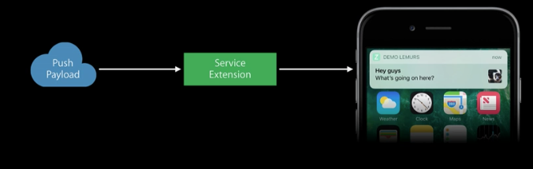
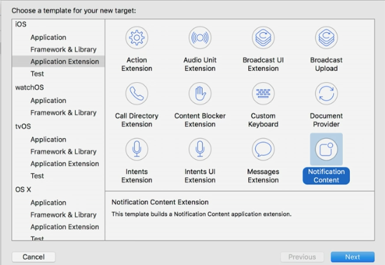
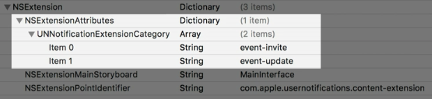
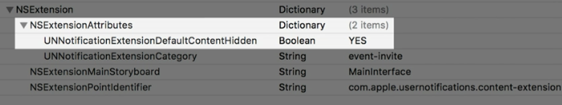
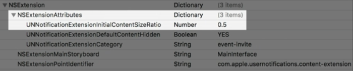

## Advanced Notifications

### 0x1、Media Attachments



figure 1, service extension

```
// 1st, payload

// size: 256Bytes(iOS 8 before), 2kBytes(after iOS 8), 4kBytes(after iOS9), larger than 4kBytes(after iOS X, unmentioned exact number)
{
	aps:{
		alert:{...},
		mutable-content:1
	}
	my-attachment:"https://example.com/photo.jpg"
}

// 2nd, service extension(remote and local notification)
public class NENotificationService:UNNotificationServiceExtension {
	override public func didReceive(_ request:UNNotificationRequest, withContentHandler contentHandler:(UNNotificationContent)->void {
		let file_url = //...
		
		// notification surppot image(contains gif), video and audio etc. 
		// downloaded in service extension, limited processing time and size
		let attachment = UNNotificationAttachment(identifier:"image" url:file_url options:nil)
		
		// add attachment to notification
		let content = request.content.mutableCopy as! UNMutableNotificationContent
		content.attachments = [attachment]
		contentHandler(content)
		
		// file is moved and managed by iOS system
	}
}

// 3rd, ...
```

### 0x2、Custom User Interface

1. `Notification` content extension
2. Custom views
3. No interaction
4. Respond to `Notification` actions

#### 1 `Notification` content extension

**step 1**: create a new target using templete:



figure 2, content extension templete

```
// minimal content extension

class NENotificationViewController:UIViewController, UNNotificationContentExtension {
	
	@IBOutlet var label:UILabel?
	
	oerride func viewDidLoad() {
		super.viewDidLoad()
	}
	
	// delegate method
	func didReceive(_ notification:UNNotification) {
		label?.text = notification.request.content.body
	}
}
```

**step 2**: telling system to find your content extension



figure 3, setting info.plist

#### 2 Custom views

add ui components by code or in storyboard 

remove the highlighted item in following picture

Default content

UNNotificationExtensionDefaultContentHidden flag



figure 4, hide default notification content view

resize the view controller

```
// minimal content extension

class NENotificationViewController:UIViewController, UNNotificationContentExtension {
	
	@IBOutlet var eventTitel: UILabel!
	@IBOutlet var eventDate: UILabel!
	@IBOutlet var eventLocation: UILabel!
	@IBOutlet var eventMessage: UILabel;
	
	oerride func viewDidLoad() {
		super.viewDidLoad()
		
		// or other autolayout methods and so on.
		let size = view.bounds.size
		preferredContentSize = CGSize(width:size.width, height:size.width/2)
	}
	
	func didReceive(_ notification:UNNotification) {
		let content = notification.request.content
		
		eventTitle.text = content.title
		eventDate.text = content.subtitle
		eventMessage.text = content.body
		
		if let location = content.userInfo["location"] as ? String {
			eventLocation.text = location
		}
		
		// using notification content attachments
		if let attachment = content.attachments.first {
			if attachment.url.startAccessingSecurityScopedResource() {
				eventImage.image = UIImage(contentOfFile: attachemnt.url.path!)
				attachment.url.stopAccessingSecurityScopedResource()
			}
		}
	}
}
```

Presentation size

UNNotificationExtensionInitialContentSizeRatio flag



figure 5, setting content size ratio before code run

#### 3 interaction with notification[Actions]

##### 3.1 Default Action Handling

Delivered to the app

Notification gets dismissed immediately

##### 3.2 Interacting Action Response

Delivered to the extension

Can delay dismissal

```
// interacting notification action response

class NENotificationViewController:UIViewController, UNNotificationContentExtension {
	func didReceive(_ response:UNNotificationResponse, completionHandler done:(UNNotificationContentExtensionResponseOption)->void) {
		server.postEventResponse(response.actionIdentifier) {
			if response.actionIdentifier == "accept" {
				eventResponse.text = "Going!"
				eventResponse.textColor = UIColor.green()
			}
			else if response.actionIdentifier == "decline" {
				eventResponse.text = "Not Going :("
				eventResponse.textColor = UIColor.red()
			}
			
			// done(.dismiss)
			done(.disimssAndForwardAction)
		}
	}
}
```

##### 3.3 custom input accessory view

```
// text input action (available after iOS9)

private func makeEventExtensionCategory() -> UNNotificationCategory {
	
	let commentAction = UNTextInputNotificationAction (
			identifier: "comment",
			title: "comment",
			options: [],
			textInputButtonTitle: "Send",
			textInputPlaceholder: "Type here ...")
	
	return UNNotificationCategory(identifier : "event-invite",
										actions: [acceptAction, declineAction, commentAction],
										minialActions:[acceptAction, declineAciont],
										intendIdentifier:[],
										options: [])
}
```

```
// text input action response

class NENotificationViewController:UIViewController, UNNotificationContentExtension {
	func didReceive(_ response:UNNotificationResponse, completionHandler done:(UNNotificationContentExtensionResponseOption)->void) {
		if let textResponse = response as ? UNTextInputNotificationResponse {
			server.send(textResponse.userText)  {
				done(.dismiss)
			}
		}
	}
}
```

```
// custom input accessory view

class NENotificationViewController:UIViewController, UNNotificationContentExtension {
	override func canBecomeFirstResponder () -> Bool {
		return true
	}
	
	override var inputAccessoryView: UIView { get {
			// create your own input accessory view
			return inputView
		}
	}
	
	func didReceive(_ response: UNNotificationResponse,
		completionHandler done: (UNNotificationContentExtensionResponseOption)->Void) {
		if response.actionIdentifier == "comment" {
			becomeFirstResponder()
			textFiled.becomeFirstResponder()
		}
	}
}

```

#### 4 Push Notification Update

远程推送可以进行通知的更新，在使用 Provider API 向 APNs 提交请求时，在 HTTP/2 的 header 中 `apns-collapse-id`key 的内容将被作为该推送的标识符进行使用。多次推送同一标识符的通知即可进行更新。

#### 5 References

- location notfication available after iOS8 (2014\_713\_What's new in notifications)
- text input action on notification available after iOS9 (2015_720_What's new in notifications)