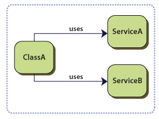
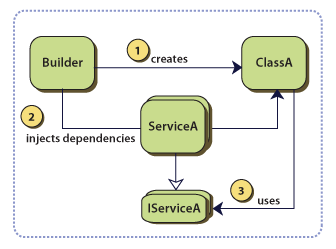

## Dependency Injection

### 0x01 Problem

若一个类（Class）依赖于一组外服，或者组件，并且其具体的类型在设计阶段指定的；例如，**ClassA**依赖于**ServiceA**和**ServiceB**，如图所示：



上面的设计存在如下的缺陷：

- 替换（或更新）依赖关系，将要修改**ClassA**的源代码
- 依赖的服务（或组件）在编译时必须有效可用的
- 难已独立测试，比如指定的依赖很难被替换或者mock
- **ClassA**存在冗余的代码用于创建、定位和管理依赖

### 0x02 Forces

以下任何其中一点都可以证明使用该设计模式可以有效解决上述遇到的问题：

- 解耦，使得其依赖可以被最小量的更新或替换
- 独立，无须知道其依赖具体的实现
- 可单独测试，而不需要其具体依赖的实现
- 解耦其依赖对象的生命周期的定位和管理

### 0x03 Solution

不要在类内初始化其依赖的服务或者组件，而是使用声明式的表达式。通过**Builder**获取其依赖的实例并通过**Constructor**或者**Setter**等方法传递到类的内部供其使用。如下图所示：



**ClassA:**

```
// C#
public class NewsReaderPresenter : INewsReaderPresenter
{
    private readonly INewsReaderView view;

    public NewsReaderPresenter(INewsReaderView view)
    {
        this.view = view;
    }

    public INewsReaderView View
    {
        get { return this.view; }
    }

    public void SetNewsArticle(NewsArticle article)
    {
        this.view.Model = article;
    }
}
```

**Mock:**

```
[TestMethod]
public void SetNewsArticlesSetsViewModel()
{
	 // dependency: MockNewsReaderView
    var view = new MockNewsReaderView();
    
	 // pass through Constructor
    var presenter = new NewsReaderPresenter(view);

	 // dependenty: NewsArticle
    NewsArticle article = new NewsArticle() { Title = "My Title", Body = "My Body" };
    
    // pass through property Setter
    presenter.SetNewsArticle(article);
	
	 // business code
    Assert.AreSame(article, view.Model);
}
```

### 0x04 Liabilities

依赖注入模式存在如下的缺点：

- 管理更多的依赖对象
- 确保其传入的对象可处理的
- 增加了代码的旬杂性和可理解性