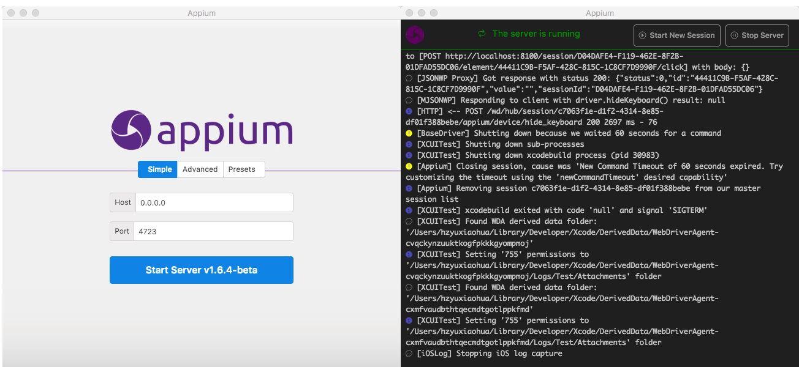
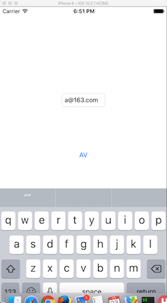

## 自动化测试之Appium体验

> **NOTE：**本文不是入门手册，仅用来作为快速上手的步骤速查手册；[官方GetStarted](https://appium.io/getting-started.html)

### 0x00 基本概念

- [Appium](https://github.com/appium/appium): 实质上是一个`NodeJS`Server，将`Appium-Client`客户端`POST`请求的脚本，通过[WebDriver](http://www.seleniumhq.org/projects/webdriver/)转换成跨平台（Web，iOS，Android）的测试指令，其中，在iOS9.0之前，使用`Instruments`下的[UIAutomation](https://developer.apple.com/reference/)，之后使用[XCUITesting](https://developer.apple.com/library/content/documentation/DeveloperTools/Conceptual/testing_with_xcode/chapters/09-ui_testing.html)框架，并将指令执行的结果返回`Appium-Client`，目前有[命令行](https://github.com/appium/appium#quick-start)和[GUI](https://bitbucket.org/appium/appium.app/downloads/)两个版本，其中GUI版本不是由官方维护；
- [Appium-Client](https://appium.io/downloads.html): 由多种语言（[Ruby](https://rubygems.org/gems/appium_lib), [Python](https://github.com/appium/python-client), [Java](https://search.maven.org/#search%7Cga%7C1%7Cg%3Aio.appium%20a%3Ajava-client), [Javascript](https://www.npmjs.com/package/wd), [C#](http://www.nuget.org/packages/Appium.WebDriver/)等）实现的对`Appium`Server接口的封装，便于用户使用`Client`提交偌的接口快速编写自动化测试脚本；

### 0x01 使用姿势

#### 1.1 启动Appium服务

> **NOTE：**工具链安装此处不表，详见[安装方法](https://appium.io/slate/en/master/?ruby#introduction-to-appium)

##### 1.1.1 GUI

若已经安装好GUI工具，不做任何额外的设置即可启动服务，如下图所示：



##### 1.1.2 Command Line

```
appium --address 127.0.0.1 --port 4273
```

### 0x02 iOS调试准备

#### 2.1 编译工程

跳转到XCode工程所在的目录，运行xcodebuild命令，如下所示：

```
// using xcode8 ios 10.2 sdk
# xcodebuild -sdk iphonesimulator
```

若编译过程中没有任何错误，将当前目录下创建`/build`目录，其目录结构如下所示：

```
./build/
├── AVPlayerDemo.build
│   ├── Release-iphoneos
│   │   └── AVPlayerDemo.build
│   └── Release-iphonesimulator
│       └── AVPlayerDemo.build
│           ├── Base.lproj
│           │   ├── LaunchScreen.storyboardc
│           │   └── Main.storyboardc
│           ├── DerivedSources
│           └── Objects-normal
│               ├── i386
│               └── x86_64
└── Release-iphonesimulator
    ├── AVPlayerDemo.app
    │   ├── Base.lproj
    │   │   ├── LaunchScreen.storyboardc
    │   │   └── Main.storyboardc
    │   ├── Frameworks
    │   ├── _CodeSignature
    │   └── videos
    ├── AVPlayerDemo.app.dSYM
    │   └── Contents
    │       └── Resources
    │           └── DWARF
    ├── AVPlayerDemo.swiftmodule
    └── OnDemandResources
        └── com.xy.AVPlayerDemo.bt+lb+tf.assetpack
```

#### 2.2 安装并启动编译后的应用程序

使用`Python-Client`为例，代码如下所示：

```
from appium import webdriver

desired_caps = {}
desired_caps['platformName'] = 'iOS'
desired_caps['platformVersion'] = '10.2'
desired_caps['deviceName'] = 'iPhone Simulator'

// 若已经在模拟器中安装了相应的应用，可以使用bundle_id直接启动应用，无须再次安装
# desired_caps['bundleId'] = 'com.xy.AVPlayerDemo'

// 重新安装指定的应用程序，每次启动都重新安装，绝对路径
desired_caps['app'] = '/.../AbsolutePath/.../AVPlayerDemo.app'

```

### 0x03 开始自动化测试



这一节可以直接参考各`Appium-Client`的示例Demo中的代码，或查看对应的接口文档；直接上示例代码：

```
import unittest
from appium import webdriver

desired_caps = {}
desired_caps['platformName'] = 'iOS'
desired_caps['platformVersion'] = '10.2'
desired_caps['deviceName'] = 'iPhone Simulator'
desired_caps['bundleId'] = 'com.xy.AVPlayerDemo'
# desired_caps['app'] = '/Users/hzyuxiaohua/projects/AVPlayerDemo/build/Release-iphonesimulator/AVPlayerDemo.app'

# create a new session
driver = webdriver.Remote('http://127.0.0.1:4723/wd/hub', desired_caps)

# get a button element, called "AV"
bt = driver.find_element_by_name('AV')

# get a button element using accessibility id, called "button_av_show" 
# bt = driver.find_element_by_accessibility_id('button_av_show')
bt.click()


# lb = driver.find_element_by_name('Label')
# print(lb.get_attribute('value'))
# lb.__setattr__('text','null')

# driver.background_app(1)

# tf = driver.find_element_by_class_name('XCUIElementTypeTextField')
tf = driver.find_element_by_accessibility_id('text_field_email')
tf.send_keys('qa@163.com')
# print(tf.get_attribute('value'))
driver.hide_keyboard()
```