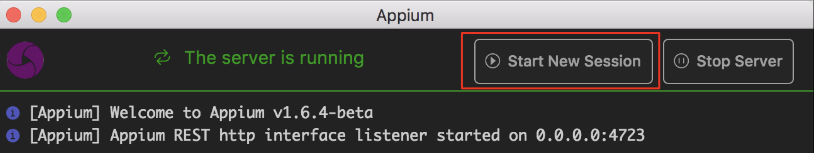
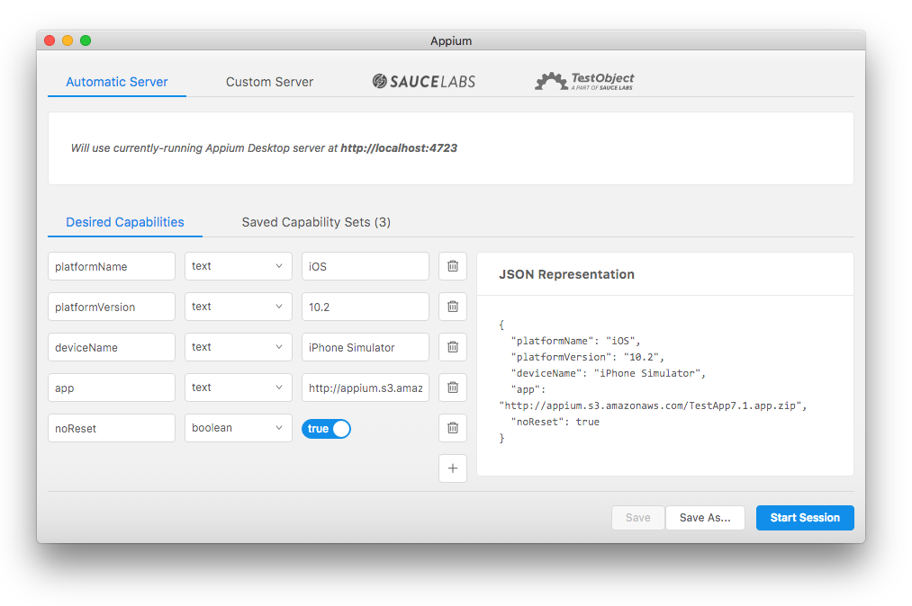
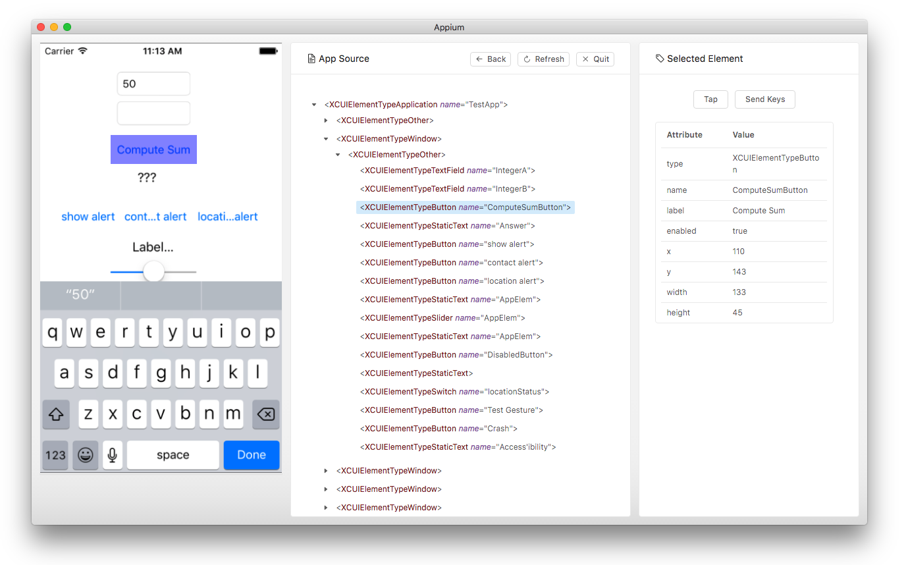

## 自动化测试之Appium体验

> **NOTE：**本文不是入门手册，仅用来作为快速上手的步骤速查手册；[官方GetStarted](https://appium.io/getting-started.html)

### 0x00 基本概念

- [Appium](https://github.com/appium/appium): 实质上是一个`NodeJS`Server，将`Appium-Client`客户端`POST`请求的脚本，通过[WebDriver](http://www.seleniumhq.org/projects/webdriver/)转换成跨平台（Web，iOS，Android）的测试指令，其中，在iOS9.0之前，使用`Instruments`下的[UIAutomation](https://developer.apple.com/reference/)，之后使用[XCUITesting](https://developer.apple.com/library/content/documentation/DeveloperTools/Conceptual/testing_with_xcode/chapters/09-ui_testing.html)框架，并将指令执行的结果返回`Appium-Client`，目前有[命令行](https://github.com/appium/appium#quick-start)和[GUI](https://bitbucket.org/appium/appium.app/downloads/)两个版本，其中GUI版本不是由官方维护；
- [Appium-Client](https://appium.io/downloads.html): 由多种语言（[Ruby](https://rubygems.org/gems/appium_lib), [Python](https://github.com/appium/python-client), [Java](https://search.maven.org/#search%7Cga%7C1%7Cg%3Aio.appium%20a%3Ajava-client), [Javascript](https://www.npmjs.com/package/wd), [C#](http://www.nuget.org/packages/Appium.WebDriver/)等）实现的对`Appium`Server接口的封装，便于用户使用`Client`提交偌的接口快速编写自动化测试脚本；

### 0x01 使用姿势

#### 1.1 启动Appium服务

> **NOTE：**工具链安装此处不表，详见[安装方法](https://appium.io/slate/en/master/?ruby#introduction-to-appium)

##### 1.1.1 GUI

若已经安装好GUI工具，不做任何额外的设置即可启动服务，如下图所示：


##### 1.1.2 Command Line

```
appium --address 127.0.0.1 --port 4273
```

### 0x02 iOS调试准备

#### 2.1 编译工程

跳转到XCode工程所在的目录，运行xcodebuild命令，如下所示：

```
// using xcode8 ios 10.2 sdk
# xcodebuild -sdk iphonesimulator
```

若编译过程中没有任何错误，将当前目录下创建`/build`目录，其目录结构如下所示：

```
./build/
├── AVPlayerDemo.build
│   ├── Release-iphoneos
│   │   └── AVPlayerDemo.build
│   └── Release-iphonesimulator
│       └── AVPlayerDemo.build
│           ├── Base.lproj
│           │   ├── LaunchScreen.storyboardc
│           │   └── Main.storyboardc
│           ├── DerivedSources
│           └── Objects-normal
│               ├── i386
│               └── x86_64
└── Release-iphonesimulator
    ├── AVPlayerDemo.app
    │   ├── Base.lproj
    │   │   ├── LaunchScreen.storyboardc
    │   │   └── Main.storyboardc
    │   ├── Frameworks
    │   ├── _CodeSignature
    │   └── videos
    ├── AVPlayerDemo.app.dSYM
    │   └── Contents
    │       └── Resources
    │           └── DWARF
    ├── AVPlayerDemo.swiftmodule
    └── OnDemandResources
        └── com.xy.AVPlayerDemo.bt+lb+tf.assetpack
```

##### 2.1.1 xcodebuild命令简介

###### 1. 查看xcode支持的SDK

```
$xcodebuild -showsdks
iOS SDKs:
	iOS 10.2                      	-sdk iphoneos10.2

iOS Simulator SDKs:
	Simulator - iOS 10.2          	-sdk iphonesimulator10.2

macOS SDKs:
	macOS 10.12                   	-sdk macosx10.12

tvOS SDKs:
	tvOS 10.1                     	-sdk appletvos10.1

tvOS Simulator SDKs:
	Simulator - tvOS 10.1         	-sdk appletvsimulator10.1

watchOS SDKs:
	watchOS 3.1                   	-sdk watchos3.1

watchOS Simulator SDKs:
	Simulator - watchOS 3.1       	-sdk watchsimulator3.1
```

###### 2. Instruments支持的模拟器设备类型

```
$instruments -s devices

Known Devices:
hzyuxiaohua的Mac mini [B73BA4A0-ED69-5EFA-9DB8-D2E9CC16DBC7]
Apple TV 1080p (10.1) [58C2290A-9A1E-45BC-88DF-679B4BF758A8] (Simulator)
Apple Watch - 38mm (3.1) [F2656F43-B1E2-482A-8847-A52649733B2E] (Simulator)
Apple Watch - 42mm (3.1) [8978202F-2A35-4CB4-B628-455A1B68782C] (Simulator)
iPad Air (10.2) [EEEBA8BD-5CB2-4A85-8E50-D2E6891D7A69] (Simulator)
iPad Air 2 (10.2) [438789A2-57C2-4845-8198-A18DFBC4C0A5] (Simulator)
iPad Pro (12.9 inch) (10.2) [63A3331F-56B1-45FF-A351-FF91C7247293] (Simulator)
iPad Pro (9.7 inch) (10.2) [F939AF17-F2D2-4E56-A449-0C102A80D3EF] (Simulator)
iPad Retina (10.2) [785B6020-0FF3-4578-AD60-DF09693B9E89] (Simulator)
iPhone 5 (10.2) [E5F1205C-99CF-472D-AAF8-396E632CC8ED] (Simulator)
iPhone 5s (10.2) [5708E973-EE3C-409F-9454-BBAA10AB0FF8] (Simulator)
iPhone 6 (10.2) [956DAAD6-7180-4045-B90D-4A9B2E87975D] (Simulator)
iPhone 6 Plus (10.2) [AAB52FA6-B8E7-40EF-ADC8-E76F161B7288] (Simulator)
iPhone 6s (10.2) [6BEE5359-479D-4572-88FE-0E0BB86B11BD] (Simulator)
iPhone 6s Plus (10.2) [373EAF61-75DB-437E-B11C-45757C86A324] (Simulator)
iPhone 7 (10.2) [48F0C129-61D6-4059-A160-B365AAD65E9F] (Simulator)
iPhone 7 (10.2) + Apple Watch Series 2 - 38mm (3.1) [0CA54EDE-5E5C-44F8-BC83-0A61F8787E7F] (Simulator)
iPhone 7 Plus (10.2) [C7B7C948-B904-496A-9BF8-90E4F618A953] (Simulator)
iPhone 7 Plus (10.2) + Apple Watch Series 2 - 42mm (3.1) [C866B22B-ECBB-48E0-8BAF-213DCB656E4E] (Simulator)
iPhone SE (10.2) [9DB54B0F-501B-47B0-937C-3C826589DD00] (Simulator)
```

###### 2. 查看目标工程

```
$xcodebuild -list
Information about project "mail":
    Targets:
        mailmaster
        mailmasterpro

    Build Configurations:
        Debug
        Release
        ReleaseBeta
        ReleaseStore

    If no build configuration is specified and -scheme is not passed then "ReleaseBeta" is used.

    Schemes:
        libetpan
```

###### 3. 编译一个复杂的工程

```
// product='mail'
// scheme='mailmaster'
$xcodebuild -workspace 「product」.xcworkspace -scheme 「scheme」 -destination 'platform=iOS Simulator,name=iPhone SE'

// 生成的mail.app在以下绝对路径
# Touch /Users/「home」/Library/Developer/Xcode/DerivedData/「product-udid」/Build/Products/Debug-iphonesimulator/mail.app

```

#### 2.2 Authorizing iOS Simulator

具体授权方式[详见官方描述](http://appium.io/slate/en/master/?javascript#system-setup-ios)

#### 2.3 安装并启动编译后的应用程序

使用`Python-Client`为例，代码如下所示：

```
from appium import webdriver

desired_caps = {}
desired_caps['platformName'] = 'iOS'
desired_caps['platformVersion'] = '10.2'
desired_caps['deviceName'] = 'iPhone Simulator'

// 若已经在模拟器中安装了相应的应用，可以使用bundle_id直接启动应用，无须再次安装
# desired_caps['bundleId'] = 'com.xy.AVPlayerDemo'

// 重新安装指定的应用程序，每次启动都重新安装，绝对路径
desired_caps['app'] = '/.../AbsolutePath/.../AVPlayerDemo.app'

```

### 0x03 RealDevice Automation Testing

真机调试及配置[详见官方文档](https://github.com/appium/appium/blob/master/docs/en/appium-setup/real-devices-ios.md)

### 0x04 Appium Desktop GUI Inspector

#### 4.1 启动

启动`Server`后，点击图片中**红框**内的按钮(这交互略扯，我用了半天居然没有发现这里面别有洞天)



#### 4.2 创建新的会话



#### 4.3 开启Inspector



### 0x05 开始自动化测试


这一节可以直接参考各`Appium-Client`的示例Demo中的代码，或查看对应的接口文档；直接上示例代码：

```
import unittest
from appium import webdriver

desired_caps = {}
desired_caps['platformName'] = 'iOS'
desired_caps['platformVersion'] = '10.2'
desired_caps['deviceName'] = 'iPhone Simulator'
desired_caps['bundleId'] = 'com.xy.AVPlayerDemo'
# desired_caps['app'] = '/Users/hzyuxiaohua/projects/AVPlayerDemo/build/Release-iphonesimulator/AVPlayerDemo.app'

# create a new session
driver = webdriver.Remote('http://127.0.0.1:4723/wd/hub', desired_caps)

# get a button element, called "AV"
bt = driver.find_element_by_name('AV')

# get a button element using accessibility id, called "button_av_show" 
# bt = driver.find_element_by_accessibility_id('button_av_show')
bt.click()


# lb = driver.find_element_by_name('Label')
# print(lb.get_attribute('value'))
# lb.__setattr__('text','null')

# driver.background_app(1)

# tf = driver.find_element_by_class_name('XCUIElementTypeTextField')
tf = driver.find_element_by_accessibility_id('text_field_email')
tf.send_keys('qa@163.com')
# print(tf.get_attribute('value'))
driver.hide_keyboard()
```

更多的[Capabilities详见官方文档](https://github.com/appium/appium/blob/master/docs/en/writing-running-appium/caps.md)